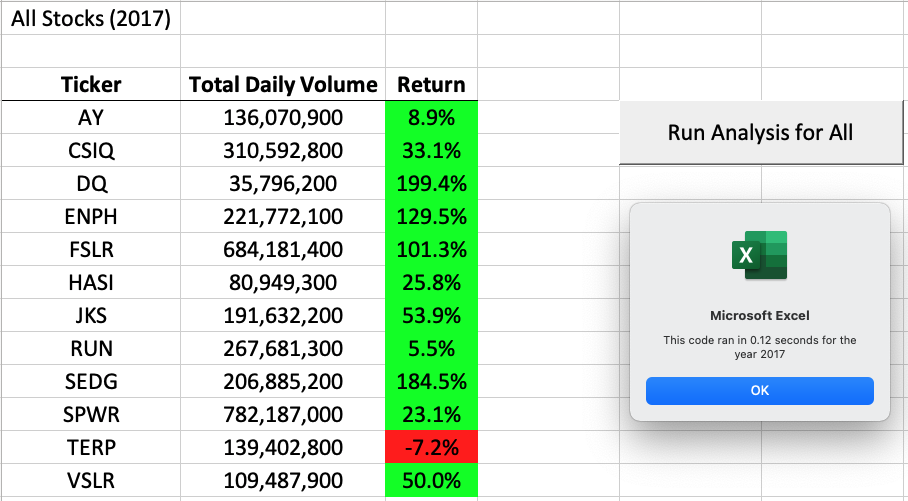
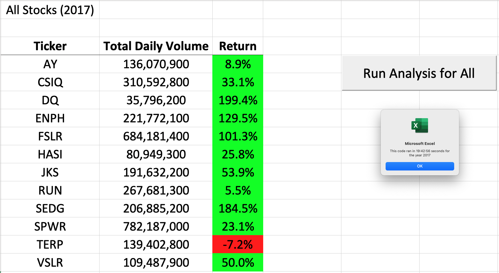
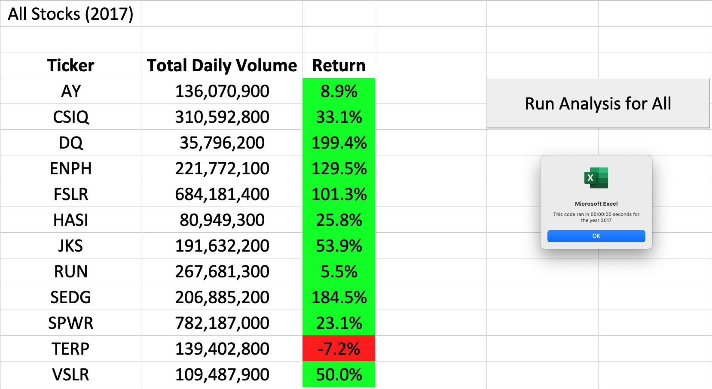

# stock-analysis

## Overview of Project

### Purpose
The purpose of this analysis is to compare the total daily volume and yearly return for various green energy stocks. This analysis will provide insight on how the various green energy stocks compared to each other, and specifically DAQO New Energy Corp (DQ) in 2017 and 2018.

## Analysis and Challenges

The data preparation includes refactoring the original VBA script by reorganizing arrays, for loops, and if-then statements. This helped to convert the data into a more efficient format and run faster. Insight are generated on the <a href="VBA_Challenge.xlsm">VBA Analysis spreadsheet</a>.

### Results

## Analysis and Results of 2017 Stocks

**Analysis**

1. On average, the total daily volume of stocks traded is 263,886,592, with the highest being SPWR and the lowest being DQ.

2. Overall, 2017 was a positive year. All stocks but TERP had a positive return. The average return rate for all stocks are 67.3%

**Results**

DQ performed the best in this dataset. They had the highest return with 199.4% but the least total daily volume. 

## Analysis and Results of 2018 Stocks

**Analysis**

1. On average, the total daily volume of stocks traded is 275,503,183, with the highest being ENPH and the lowest being AY. 

2. 2018 produced mostly negative results, with only ENPH and RUN stocks producing a positive return. The average return rate for all stocks are -8.5%

**Results**

DQ performed the worst in this dataset. They had the least return and the total daily volume is less than average. 

## Performance of Refactored Code

The timestamp is represented in the format hh:mm:ss.

**Original Code**

The <a href="Module/green_stocks.xlsm">original code</a> ran for 19:42:56 seconds for the year 2017.

**Refactored Code**

The <a href="VBA_Challenge.xlsm">refactored code</a> ran for 00:00:00 seconds for the year 2017.

### Summary
**What are the advantages or disadvantages of refactoring code?**

The advantages of refactoring the code was that the time required to run the code is significnatly decreased. The time to run the refactored code is 0 seconds, in comparison to the 19 hours. 

The disadvantages to the refactored code is 

**How do these pros and cons apply to refactoring the original VBA script?**

