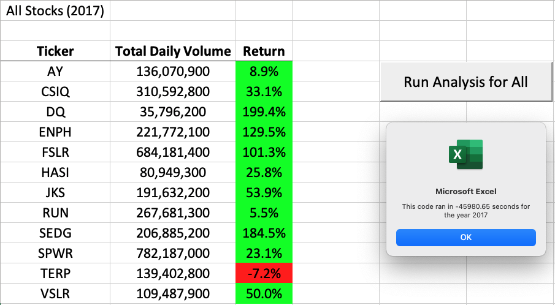
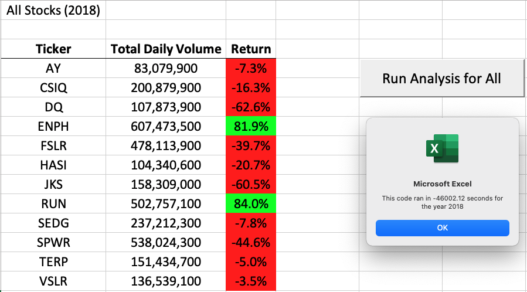

# stock-analysis

## Overview of Project

### Purpose
The purpose of this analysis is to compare the total daily volume and the yearly return for various green energy stocks in 2017 and 2018. This analysis will compare how the different green energy stocks performed to each other and specifically how DAQO New Energy Corp (DQ) achieved in relation to the others.

## Analysis and Challenges

The data preparation includes refactoring the original VBA script by reorganizing arrays, for loops, and if-then statements. This helped to convert the data into a more efficient format and run faster. Insight are generated on the <a href="VBA_Challenge.xlsm">VBA Analysis spreadsheet</a>.

## Results

### Analysis and Results of 2017 Stocks

**Analysis**

1. On average, the total daily volume of stocks traded in 2017 is 263,886,592, with the highest being SPWR and the lowest being DQ.

2. Overall, 2017 was a positive year. All stocks but TERP had a positive return. The average return rate for all stocks are 67.3%

**Results**

DQ performed the best in this dataset. They had the highest return with 199.4% but the least total daily volume. 

### Analysis and Results of 2018 Stocks

**Analysis**

1. On average, the total daily volume of stocks traded in 2018 is 275,503,183, with the highest being ENPH and the lowest being AY. 

2. 2018 produced mostly negative results, with only ENPH and RUN stocks producing a positive return. The average return rate for all stocks are -8.5%

**Results**

DQ performed the worst in this dataset. They had the least return and the total daily volume is less than average. 

### Execution Times

**Analysis**

The execution times are calculated based on how long the code took to ran in seconds. 

The <a href="Module/green_stocks.xlsm">original code</a> in 2017 ran in -45,980.65 seconds and in 2018 ran in -46,002.12 seconds. 

Whereas the <a href="VBA_Challenge.xlsm">refactored code</a> in 2017 ran in 0.12 seconds and in 2018 ran in 0.11 seconds. (Refer above for the execution times for the refactoed code.)

**Results**

Firstly, the results of the execution time for the original code is negative. This is because the time is stored in microseconds in a 32-bit signed integer. This means that when converting this time, a -45,000 seconds code would run in approximately 3 hours. 

Therefore after refactoring the code, the execution time was significantly faster. The evidence that the code ran faster is the following: 

1. The refactored code ran in 0.11 to 0.12 seconds compared to approximately 3 hours.

2. Both codes had the same formula for analyzing the executed time, but the refactored code is in a readable format. Whereas the original code was in an unreadble microseconds integer format that we had to convert to an approximate timeframe.

## Summary
**What are the advantages or disadvantages of refactoring code?**

The advantages of refactoring the code is that it is easier to understand, less complex and easier to maintain. It helps us find bugs and helps in executing the program faster. 

The disadvantages to the refactored code is that it is extremely time consuming and could cost a lot of money. For bigger scaled projects, the developer may not know how long it will take to write the code or how much it could cost, which can cause delays in a business. 

**How do these pros and cons apply to refactoring the original VBA script?**

In relation to the original code, the pros of refactoring is that the code ran significantly more efficient. It is also a lot easier to understand and read. For example, in our refactored code, we didn't need to utilize a nested loop and we only needed 1 variable (i). This allowed our code to run a lot faster and produce the same results. 

Another benefit of refactoring the code is that it forced me to think about different ways to implement the code that I did not think of originally. 

The cons are that it took a lot of time rewriting the code which ultimately resulted in the success of the final product, however, required countless attempts and many failures and error codes. 